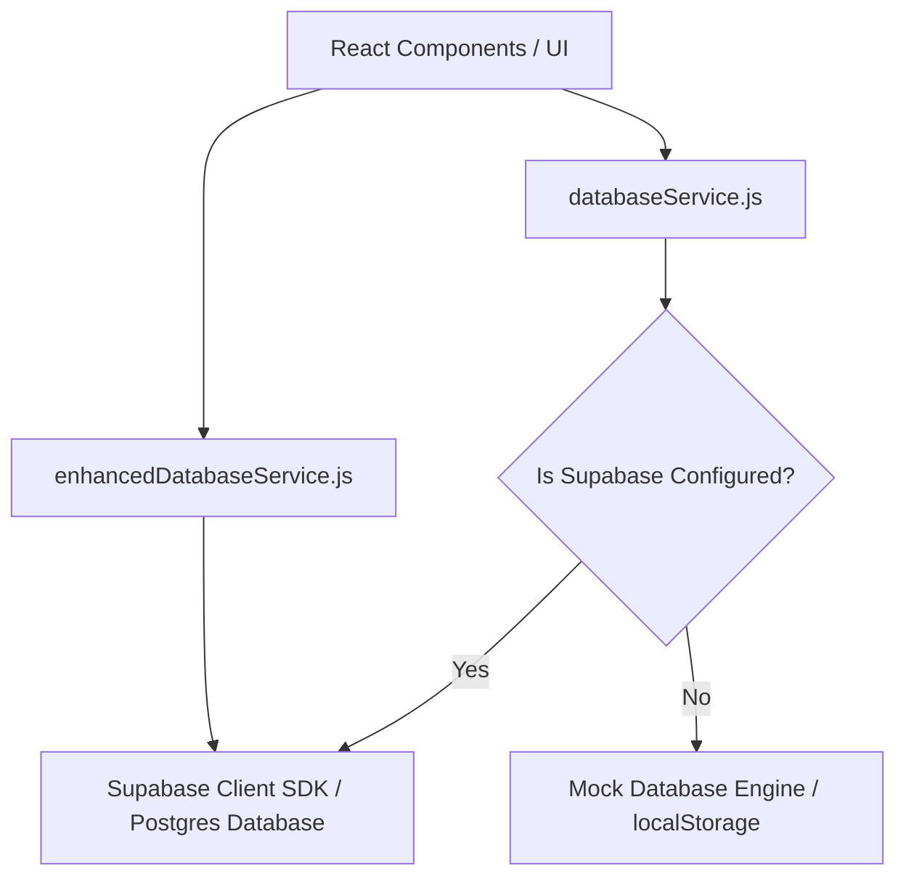
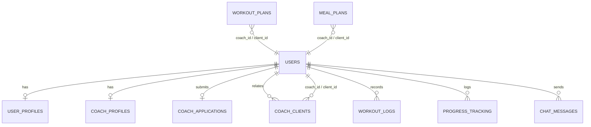

# FitEngineers Application Architecture

Welcome to the **FitEngineers** developer onboarding and architecture guide. This document provides an end-to-end technical overview of the project, detailing its components, database design, security mechanisms, and workflows to help new developers get up to speed quickly.

---

## 📋 Table of Contents

1. [System Overview](#1-system-overview)
2. [Technology Stack](#2-technology-stack)
3. [Architecture Philosophy & Data Layers](#3-architecture-philosophy--data-layers)
4. [User Roles & RBAC (Role-Based Access Control)](#4-user-roles--rbac-role-based-access-control)
5. [Database Schema & Relationships](#5-database-schema--relationships)
6. [API Design & Integration](#6-api-design--integration)
7. [Frontend Architecture & Components](#7-frontend-architecture--components)
8. [Background Services & Web Push (PWA)](#8-background-services--web-push-pwa)
9. [Local Setup & Development Guidelines](#9-local-setup--development-guidelines)

---

## 1. System Overview

**FitEngineers** is a modern, responsive Progressive Web Application (PWA) designed for personalized fitness, nutrition tracking, and coaching. It acts as a bridge between fitness trainers (coaches) and their clients, while providing platform administrators with full control over the ecosystem.

### Core Features

- **Clients**:
  - Personalized onboarding and goal determination (e.g., Fat Loss, Muscle Building).
  - Daily tracking of hydration, step count, calories, and macros (protein, fats, carbs).
  - Smart meal planners and AI meal scanners.
  - Workout execution trackers (recording exercises, sets, reps, and weights).
  - Progress tracking (weight changes, bodily measurements, and photo logs).
  - Real-time coaching chat.
  - Lock-screen reminders, posture checks, and hydration prompts.
- **Coaches (Trainers)**:
  - Client management dashboards to supervise assigned clients.
  - Custom workout plan creator and food regimen assigner.
  - Client metrics visualization and chat portal.
- **Super Administrators**:
  - Dashboards to view platform analytics, inspect all users, and view audit trails.
  - Approval workflow for onboarding coach applicants.

---

## 2. Technology Stack

- **Frontend**: [React 19](https://react.dev/) + [Vite](https://vite.dev/)
- **Styles**: Vanilla CSS for layouts and interactive styling (no CSS frameworks by default).
- **Backend / Database**: [Supabase](https://supabase.com/) (PostgreSQL + Auth + Storage).
- **Serverless API Routes**: [Vercel Serverless Functions](https://vercel.com/docs/functions/serverless-functions) (deployed in the `api/` directory) for auxiliary jobs (push subscriptions, notifications, password recovery triggers).
- **Push Engine**: [Web-Push](https://www.npmjs.com/package/web-push) (Node.js) for VAPID-based push notifications.
- **PWA**: Service Worker registration with local visibility checks.

---

## 3. Architecture Philosophy & Data Layers

The application uses a **Dual-Layer Data Layer** designed for both offline local testing and live production deployment.



### Local Storage Fallback (Mock DB)
If Supabase environment variables are missing (e.g., `VITE_SUPABASE_URL` and `VITE_SUPABASE_ANON_KEY`), the `databaseService.js` script transparently falls back to a custom database simulation stored entirely in `window.localStorage`.
- Mock tables like `mock_users`, `mock_coaches`, `mock_clients`, and `mock_coach_applications` emulate database structures.
- Allows developers to run the entire app (including trainer and admin dashboards) locally on their browsers without needing database credentials.

### Live Cloud Integration
When Supabase is configured:
- Read/write operations interact with a live cloud database.
- Synchronization of local user state to the cloud occurs through a debounced polling loop in [App.jsx](file:///Users/mankalmr/Documents/Projects/Fitengineerss-app/src/App.jsx#L494-L527) (updates are verified and synced every 5 seconds).

---

## 4. User Roles & RBAC (Role-Based Access Control)

Access control is strictly enforced at three levels:
1. **Frontend Views & Guard Utilities**: Checked inside [accessControl.js](file:///Users/mankalmr/Documents/Projects/Fitengineerss-app/src/services/accessControl.js).
2. **Backend Services & Serverless Functions**: Validation of user sessions and email filters.
3. **Database Level**: Postgres Row Level Security (RLS) policies.

### Platform Roles

| Role | Details | Target Dashboard | Permissions |
| :--- | :--- | :--- | :--- |
| **Client** (`client`) | Default user | `/dashboard` | Update own physical metrics, log workouts, view custom nutrition/workouts, chat with assigned coach. |
| **Coach** (`coach`) | Required application approval | `/coach-dashboard` | Manage assigned clients, create workout plans, view client logs, chat with clients. |
| **Super Admin** | Hardcoded to `subodhmankala@gmail.com` | `/admin-dashboard` | Manage global settings, review and approve coach applications, inspect all users, view audit logs. |

### Access Enforcement Workflow
```
[User Authenticated]
         │
         ├──► Email matches "subodhmankala@gmail.com"?
         │         ├──► Yes: Assign "super-admin" role -> Grant access to Admin Dashboard
         │
         ├──► Role is "coach"?
         │         ├──► Approved by Admin?
         │         │         ├──► Yes: Grant access to Trainer Dashboard
         │         │         └──► No (Pending): Redirect to application status page
         │
         └──► Otherwise: Assign "client" role -> Grant access to Client Dashboard
```

---

## 5. Database Schema & Relationships

The database is built on PostgreSQL with strict primary-foreign key relationships, optimized indexes, and enabled Row Level Security (RLS) policies.



### Table Details & Layouts

#### 1. Core Users (`users`)
Stores core identity records and assigned roles.
- `id` (UUID, Primary Key)
- `email` (TEXT, Unique)
- `full_name` (TEXT)
- `role` (TEXT, Check constraints: `client`, `coach`, `coach_pending`, `super-admin`)
- `verified` (BOOLEAN) - Used for coach vetting
- `active` (BOOLEAN) - Soft-delete flag

#### 2. Profiles (`user_profiles` & `coach_profiles`)
Extend user tables with roles-specific statistics.
- `user_profiles` contains physical parameters (e.g., `weight_kg`, `height_cm`, `calorie_target`, `fitness_goal`).
- `coach_profiles` stores professional summaries (e.g., `certifications`, `experience_years`, `availability`, `max_clients`, `approved`).

#### 3. Relationships & Plans (`coach_clients`, `workout_plans`, `meal_plans`)
- `coach_clients` map clients to their coaches (composite unique constraint on `coach_id` and `client_id`).
- `workout_plans` and `meal_plans` support flexible storage using `JSONB` parameters to log list matrices (exercises, meal sequences, target macros).

#### 4. Logging & Tracking (`workout_logs`, `progress_tracking`, `tracker_logs`)
- `workout_logs` logs completed routines, sets, reps, and weights.
- `progress_tracking` tracks body fat changes, measurements, and progress photos.
- `tracker_logs` aggregates daily steps, water intake, and calorie consumption.

### Row Level Security (RLS)
Every table has RLS enabled. Policies ensure that:
- Clients can **only** read and write their own rows.
- Coaches can read data associated with their clients (via `coach_clients` relations).
- Admins have read-write access to admin-facing resources (applications, system audit logs).

---

## 6. API Design & Integration

FitEngineers maps out clear routes divided by domain roles, documented fully inside [API_ENDPOINTS.js](file:///Users/mankalmr/Documents/Projects/Fitengineerss-app/docs/API_ENDPOINTS.js).

### Essential Integrations

#### 1. Google OAuth (`POST /api/auth/google`)
Authenticates users via Google Identity tokens and resolves registration state.

#### 2. Coach Application & Approval Flow
- **Submission**: Unapproved coaches submit structural experience parameters to `/api/coach/applications`.
- **Review**: Super admin pulls applications and performs approvals or rejections:
  - **Approve (`POST /api/admin/applications/:id/approve`)**: Sets application status to approved, inserts record to `coach_profiles`, updates user role in `users` to `coach`, logs an entry to the system `audit_logs`, and sends out an approval email.
  - **Reject (`POST /api/admin/applications/:id/reject`)**: Updates application status to rejected and stores the reason.

#### 3. Vercel Serverless Endpoints (`api/`)
- `subscribe.js`: Registers client subscription endpoints for push events.
- `send-nudges.js`: Script for automated push notifications.
- `request-password-reset.js` & `reset-password.js`: Manage password recovery flows.

---

## 7. Frontend Architecture & Components

The application operates as a single-page React app. The core application logic resides in [App.jsx](file:///Users/mankalmr/Documents/Projects/Fitengineerss-app/src/App.jsx), which manages authentication state, visibility monitoring, and view switching.

### Directory Structure

```
src/
├── components/          # React layout components and stylesheets
│   ├── admin/            # Modular platform administrator sub-views
│   │   ├── AdminClientsList.jsx   # Single-column client list
│   │   └── AdminCoachesList.jsx   # Roster, status indicators, and profile popup
│   ├── trainer/          # Core state distribution layer
│   │   ├── context/
│   │   │   └── TrainerContext.jsx # Shared global context provider
│   │   └── hooks/
│   │       └── useTrainerData.js  # Fetching logic & PostgreSQL channel sync
│   ├── AdminExerciseLibrary.jsx   # Exercise Library Management dashboard
│   ├── TrainerDashboard.jsx       # Root shell router & guard
│   └── ...
├── assets/              # Static media files
├── services/            # Database and access control services
│   ├── accessControl.js          # Authentication and RBAC guards
│   ├── databaseService.js        # Core data Layer (Supabase + localStorage fallback)
│   └── enhancedDatabaseService.js # Extended database operations
├── utils/               # Standalone helper functions
│   ├── videoUtils.js             # YouTube parsers & guides normalization helpers
│   └── ...
├── App.jsx              # Main App wrapper & view router
├── index.css            # Global CSS styles and design system
└── main.jsx             # React entry point
```

### Component Reference

- **Core Framework & Onboarding**:
  - [Onboarding.jsx](file:///Users/mankalmr/Documents/Projects/Fitengineerss-app/src/components/Onboarding.jsx): Multi-step onboarding questionnaire with typo validations and color-shifting morphing layouts.
  - [Navbar.jsx](file:///Users/mankalmr/Documents/Projects/Fitengineerss-app/src/components/Navbar.jsx): Navigation bar.
- **Client Features**:
  - [WorkoutProgressDashboard.jsx](file:///Users/mankalmr/Documents/Projects/Fitengineerss-app/src/components/WorkoutProgressDashboard.jsx): Client landing dashboard.
  - [WorkoutTracker.jsx](file:///Users/mankalmr/Documents/Projects/Fitengineerss-app/src/components/WorkoutTracker.jsx): Visual log for tracking workout routines and exercises.
  - [NutritionTracker.jsx](file:///Users/mankalmr/Documents/Projects/Fitengineerss-app/src/components/NutritionTracker.jsx): Daily macro planner, meal scanners, and water logs.
  - [CoachChat.jsx](file:///Users/mankalmr/Documents/Projects/Fitengineerss-app/src/components/CoachChat.jsx): Messaging UI between clients and coaches.
  - [ProgressDashboard.jsx](file:///Users/mankalmr/Documents/Projects/Fitengineerss-app/src/components/ProgressDashboard.jsx): Interactive metrics charts plotting physical changes over time.
- **Coach & Admin Portals**:
  - [TrainerDashboard.jsx](file:///Users/mankalmr/Documents/Projects/Fitengineerss-app/src/components/TrainerDashboard.jsx): Coordinates trainer workspaces; consumes decoupled global state from `TrainerContext`.
  - [AdminExerciseLibrary.jsx](file:///Users/mankalmr/Documents/Projects/Fitengineerss-app/src/components/AdminExerciseLibrary.jsx): Searchable directory supporting native video uploads, direct MP4 paths, and responsive YouTube frame embedded players.
  - [CoachLogin.jsx](file:///Users/mankalmr/Documents/Projects/Fitengineerss-app/src/components/CoachLogin.jsx): Portal for coach sign-ins and application submissions.

---

## 8. Background Services & Web Push (PWA)

### Service Worker (`public/sw.js`)
- The service worker handles incoming push notifications when the app is in the background.
- It intercepts push events, extracts JSON payloads, and calls `registration.showNotification()`.
- Handles notification clicks, automatically focusing existing windows or opening new ones.

### Local Visibility Reminders
To ensure consistent tracking without spamming server requests, the frontend sets up a local scheduler when the app is in focus:
- Listens to document visibility changes (`hidden` or `visible`).
- Dispatches posture check-ins and fluid alerts directly to the notification queue based on time intervals.

---

## 9. Local Setup & Development Guidelines

Follow these steps to run and test the application on your system:

### 1. Prerequisites
- [Node.js](https://nodejs.org/) (v18 or higher recommended)
- npm or yarn package manager

### 2. Installation
Clone the repository and install the project dependencies:
```bash
npm install
```

### 3. Environment Configuration
Create a `.env` file in the root directory:
```env
VITE_SUPABASE_URL=your_supabase_url
VITE_SUPABASE_ANON_KEY=your_anon_key
VITE_SUPER_ADMIN_EMAIL=subodhmankala@gmail.com
```
*Note: If these variables are omitted, the application will run in local-only fallback mode, storing all data in the browser's `localStorage`.*

### 4. Running the Development Server
Start the local server with hot-reloading (HMR):
```bash
npm run dev
```
Open [http://localhost:5173](http://localhost:5173) in your browser to view the application.

### 5. Running Unit & Integration Tests
The project uses **Vitest** for unit and component testing. To run the test suite:
```bash
npm run test
```
To run tests in watch mode during development:
```bash
npm run test:watch
```
All helper functions (date formats, video parsers, access flags checks) and React hooks/context layers must retain 100% test coverage.

### 6. Code Integrity Guidelines
- **Maintain local-only testing**: Ensure any modifications to services check the configuration status (`isSupabaseConfigured`) and support the `localStorage` fallback where applicable.
- **Row Level Security (RLS)**: When creating new database schemas, always enable RLS and test policies for all target roles.
- **Audit Trails**: Sensitive actions performed by coaches or admins must be logged to the `audit_logs` table using the `createAuditLog` utility in `accessControl.js`.